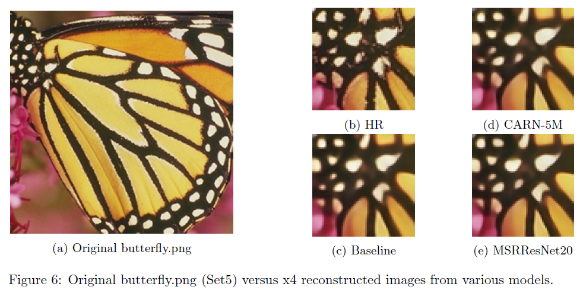

# AI6126: Mini-DIV2K SISR Challenge

## Problem Overview

The goal of this mini challenge is to increase the resolution of a single image (by four times). The data for this task comes from the DIV2K dataset. For this challenge, we prepared a mini-dataset, which consists of 500 training and 80 validation pairs of images, where the HR images have 2K resolution and the LR images are downsampled four times.

For each LR image, algorithms will increase the resolution of the images. The quality of the output will be evaluated based on the PSNR between the output and HR images. The idea is to allow an algorithm to reveal more details imperceptible in the LR image.

<u>Constraints</u>:

1. Train your network using our provided mini training set.
2. Model should contain fewer than 1,821,085 trainable parameters, which is 120% of the trainable parameters in SRResNet.
3. No external data and pretrained models are allowed in this mini challenge.
4. You should not use an ensemble of models.

<u>Assessment</u>

We will evaluate and rank the performance of your network model on our given 80 testing LR images based on the PSNR. The higher the rank of your solution, the higher the score you will receive.

## Submitted Model

MSRResNet (Modified SRResNet) with 20 residual blocks has a total of 1,812,995 parameters, trained using standard geometric augmentations, RGB permutation, Blend and MixUp augmentations obtained a PSNR score of 28.99 in Mini-DIV2k test set.



## Submission Files

```
data
|
└───DIV2K
	└───Train
		└───HR_sub.lmdb
		└───LR_x4_sub.lmdb
	└───Val
        └───HR
        └───LR_x4
└───PTest							
	└───LR			// Private testset
|
src
│   
└───BasicSR
	|	// other codes
	└main_train.py	// to run training
    └main_test.py	// to run testing
    |
    └───experiments // contains trained model
    └───results		// contains generated PTest images
│ 
└───final_model // contains trained model
└───results // contains generated PTest images
```

## System Setup

Please install the necessary libraries to run BasicSR.

```shell
cd BasicSR
pip install -r requirements.txt
python setup.py develop --no_cuda_ext
```

## How to Train

1. Generate the HR_sub.lmdb file and LR_x4_sub.lmdb files by running "**BasicSR/scripts/extract_subimages.py**" and "**BasicSR/scripts/create_lmdb.py**".

2. As the configurations for training the final model is already preset in "**BasicSR/options/train/CARN/train_MSRResNet_x4.xml**". Running the "**main_train.py**" script will start the training process.

   ```shell
   python3 main_train.py 
   ```

## How to Test

As the configurations to generate the outputs of the final model is already preset in "**BasicSR/options/test/CARN/test_MSRResNet_x4_woGT.xml**". Running the "**main_test.py**"  script will start the testing process.

```shell
python3 main_test.py 
```

## Main Code Modifications

+ [Added] "BasicSR/basicsr/main_train.py
+ [Added] "BasicSR/basicsr/main_test.py
+ [Added] "BasicSR/basicsr/data/augments.py"
+ [Added] "BasicSR/basicsr/models/carn_arch.py"
+ [Added]  "BasicSR/tests/test_augments.py"
+ [Updated] "BasicSR/basicsr/models/sr_model.py"
+ [Updated] "BasicSR/basicsr/train.py"
+ [Updated] "BasicSR/basicsr/test.py"

## References

**Papers**:

1. Ahn, Namhyuk, Byungkon Kang, and Kyung-Ah Sohn. "Fast, accurate, and lightweight super-resolution with cascading residual network." *Proceedings of the European Conference on Computer Vision (ECCV)*. 2018.
2. Yoo, Jaejun, Namhyuk Ahn, and Kyung-Ah Sohn. "Rethinking data augmentation for image super-resolution: A comprehensive analysis and a new strategy." *Proceedings of the IEEE/CVF Conference on Computer Vision and Pattern Recognition*. 2020.
3. Ledig, Christian, et al. "Photo-realistic single image super-resolution using a generative adversarial network." *Proceedings of the IEEE conference on computer vision and pattern recognition*. 2017.

**Codes**:

+ [Baseline] BasicSR:
  + https://github.com/xinntao/BasicSR

+ CutBlur Data Augmentations:
  + https://github.com/clovaai/cutblur
+ CARN architecture:
  + https://github.com/nmhkahn/CARN-pytorch
  + https://github.com/clovaai/cutblur/blob/master/model/carn.py
+ mmediting:
  + https://github.com/open-mmlab/mmediting


